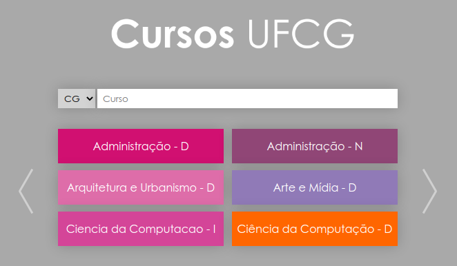

# Cursos UFCG Responsivo 

O [Cursos UFCG](http://analytics.ufcg.edu.br/cursosufcg) é um sistema *web* desenvolvido no [Laboratório Analytics](http://analytics.ufcg.edu.br/) com o objetivo de auxiliar a comunidade acadêmica da UFCG. 

  

O sistema busca facilitar o acesso e visualização acerca de informações acadêmicas e curriculares, auxiliando os alunos a analisar e planejar a matrícula em disciplinas com base em: 

- [Fluxogramas dos cursos](http://analytics.ufcg.edu.br/cursosufcg/#/ciencia_da_computacao_d_cg/requisitos) 
- [Análises de pré e pós-requisitos de disciplinas](http://analytics.ufcg.edu.br/cursosufcg/#/ciencia_da_computacao_d_cg/minha-grade)
- [Taxas de aprovação de disciplinas ao longo do tempo](http://analytics.ufcg.edu.br/cursosufcg/#/ciencia_da_computacao_d_cg/taxa-aprovacao)
- [Correlações entre disciplinas](http://analytics.ufcg.edu.br/cursosufcg/#/ciencia_da_computacao_d_cg/correlacao)
- [Análises sobre os cursos da UFCG](http://analytics.ufcg.edu.br/cursosufcg/#/ciencia_da_computacao_d_cg/raio-x)

A versão atual necessita de um *upgrade* de tecnologias e de uma interface responsiva que se adeque aos mais diferentes tamanhos de telas, de forma a atender às necessidades do maior número possível de usuários. Desta forma, o objetivo desse projeto no Andromedev é o desenvolvimento de uma nova interface responsiva para os fluxogramas dos cursos da UFCG com base em novas tecnologias. 

## Repositórios

* https://github.com/analytics-ufcg/cursos-ufcg-frontend
* https://github.com/analytics-ufcg/cursos-ufcg-backend

## Vantagens em participar do projeto

Nesse projeto o aluno terá a oportunidade de planejar um *design* de interface responsiva e gerar uma solução de sistema web com impacto direto na comunidade acadêmica, além de desenvolver novas habilidades e adquirir conhecimento sobre as tecnologias envolvidas.

## Tecnologias e ferramentas envolvidas

- [Angular JS](https://angularjs.org/)
- [Python](https://python.org/)
- Ferramentas para o desenvolvimento de APIs REST
	- A API atual utiliza a biblioteca [Flask](https://flask.palletsprojects.com/en/1.1.x/) de Python, mas podemos migrar para algo mais robusto e eficiente como [Node JS](https://nodejs.org/en/)
- [Git](https://git-scm.com/) e [GitHub](https://github.com/) para versionamento de código

## O perfil do aprendiz

Uma pessoa com interesse em desenvolvimento *web*, que tenha autonomia e proatividade na busca de conhecimento e soluções para o projeto. 

## Mentoria e Contato

Eu, Fabio Morais, sou professor do curso de Computação da UFCG e participei do processo de desenvolvimento do sistema inicial. Não hesite em me contactar para mais informações sobre o projeto!

- **E-mail**: fabio@computacao.ufcg.edu.br
- **GutHub**: [fabiomorais](https://github.com/fabiomorais)
- **LinkedIn**: [famorais](https://www.linkedin.com/in/famorais/)
